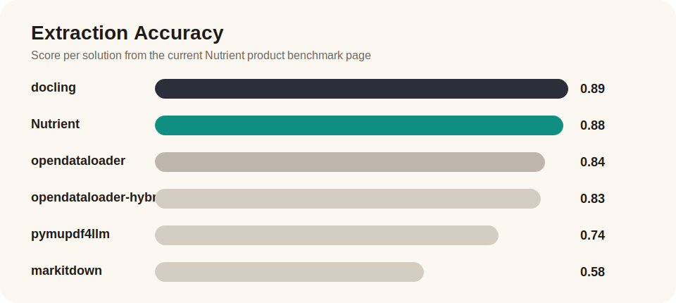
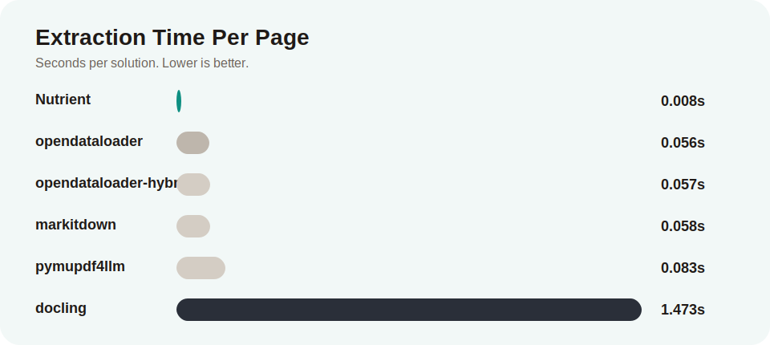
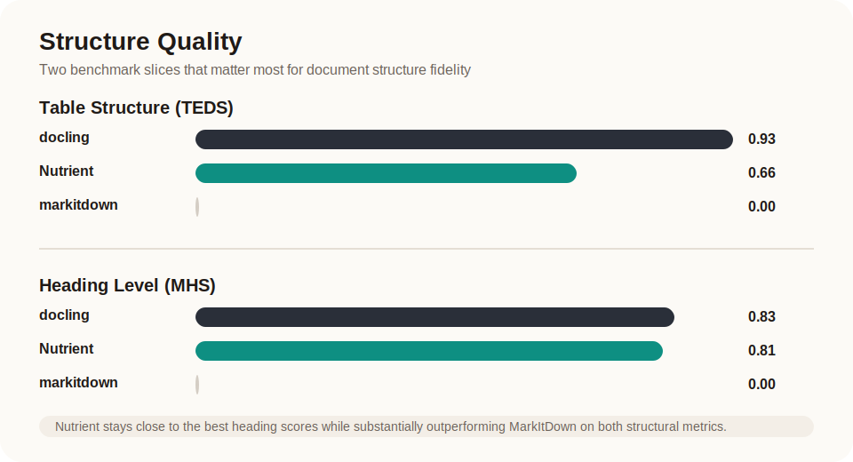
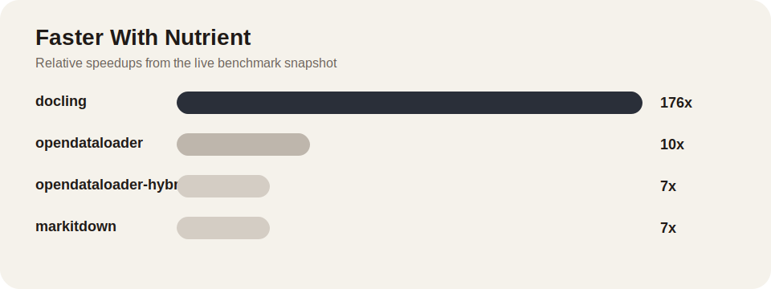

# Nutrient PDF to Markdown

**Stop wasting your context window on PDF extraction.**

Fast, accurate Markdown from PDFs — locally, with no cleanup required. Built for Claude, Codex, RAG pipelines, and document-heavy automation where noisy extraction burns tokens and makes downstream results less reliable.

- **How fast is it?** — 0.008s per page. 176x faster than docling, 10x faster than opendataloader. ([benchmarks](#benchmarks))
- **How accurate is it?** — 0.92 reading order (best in class), 0.88 overall extraction accuracy, 0.81 heading detection. ([benchmarks](#benchmarks))
- **Where do my PDFs go?** — Nowhere. The CLI runs locally. Your documents are not uploaded to Nutrient. ([trust & licensing](#trust-and-licensing))
- **What does it cost?** — Free for up to 1,000 documents per calendar month. ([license](LICENSE.md))

## Install

### Agent skill (recommended)

If you use Claude Code, Codex, Cursor, or Gemini CLI, install the [Nutrient Skills](https://github.com/pspdfkit-labs/nutrient-skills) plugin — the extraction runs automatically when your agent needs to read a PDF:

```bash
npx skills add pspdfkit-labs/nutrient-skills --skill pdf-to-markdown
```

Or with marketplace/plugin flows:

```text
/plugin marketplace add pspdfkit-labs/nutrient-skills
/plugin install pdf-to-markdown@nutrient-skills
```

### Standalone CLI

For use outside an agent, install the CLI directly:

```bash
curl -fsSL https://raw.githubusercontent.com/PSPDFKit/pdf-to-markdown/main/install.sh | sh
```

This installs `pdf-to-markdown` into `~/.local/bin` by default.

You can also install from a clone:

```bash
git clone https://github.com/PSPDFKit/pdf-to-markdown.git
cd pdf-to-markdown
./install.sh            # or: npm install -g .
```

## Usage

### Single PDF

```bash
pdf-to-markdown input.pdf output.md
```

If `output.md` is omitted, Markdown is written to stdout.

### Batch directory

```bash
pdf-to-markdown ./input-pdfs ./output-markdown
```

When both arguments are directories, the CLI converts every PDF in the input directory and writes matching Markdown files into the output directory.

## Platform Support

- macOS Apple Silicon (`Darwin/arm64`)
- Linux x86_64
- Linux arm64

## Benchmarks

Published benchmark values from [Nutrient's PDF-to-Markdown page](https://www.nutrient.io/ai/skills/pdf-to-markdown/), recorded on `AMD EPYC 9454`.

### Visual Snapshot









### Accuracy

| Metric | Nutrient | Best competitor | MarkItDown |
| --- | ---: | ---: | ---: |
| Extraction accuracy | 0.88 | 0.89 (docling) | 0.58 |
| Reading order (NID) | 0.92 | 0.91 | 0.88 |
| Table structure (TEDS) | 0.66 | 0.93 (docling) | 0.00 |
| Heading level (MHS) | 0.81 | 0.83 (docling) | 0.00 |

### Speed

| Solution | Seconds per page |
| --- | ---: |
| Nutrient | 0.008 |
| opendataloader | 0.056 |
| opendataloader-hybrid | 0.057 |
| markitdown | 0.058 |
| pymupdf4llm | 0.083 |
| docling | 1.473 |

### Faster with Nutrient

- `176x` faster than `docling`
- `10x` faster than `opendataloader`
- `7x` faster than `opendataloader-hybrid`
- `7x` faster than `pymupdf4llm`
- `7x` faster than `markitdown`

For the full comparison table, see [docs/benchmarks.md](docs/benchmarks.md).

## Trust and Licensing

- Free for up to `1,000` documents per calendar month
- PDFs stay local — your documents are not uploaded to Nutrient by this extractor
- A commercial license is required for processing more than `1,000` documents per month
- The extraction engine is delivered as a signed platform binary; the repo contains only the wrapper and documentation

See [LICENSE.md](LICENSE.md) for the full terms.

## FAQ

### What makes this different from other PDF extractors?

Speed and accuracy should not be a tradeoff. Most extractors are either fast but lose structure (markitdown, pymupdf4llm) or accurate but slow (docling). Nutrient extracts at 0.008s per page with strong reading order, heading, and table preservation — less cleanup, fewer wasted tokens, and more reliable downstream results.

### Do my documents leave my machine?

No. The CLI processes PDFs locally. Nothing is uploaded to Nutrient. Note that if you feed the extracted Markdown into Claude, Codex, or another model provider, their own data policies apply.

### How does licensing work?

Free for up to 1,000 documents per calendar month. A commercial license is required above that threshold. See [LICENSE.md](LICENSE.md) for the full terms, or contact `sales@nutrient.io`.

### Why is the extraction engine closed-source?

The repo is designed to be reviewable — you can read the wrapper, the installer, and the documentation. The extraction engine is distributed as a signed binary to protect the implementation while keeping the CLI surface fully transparent.
